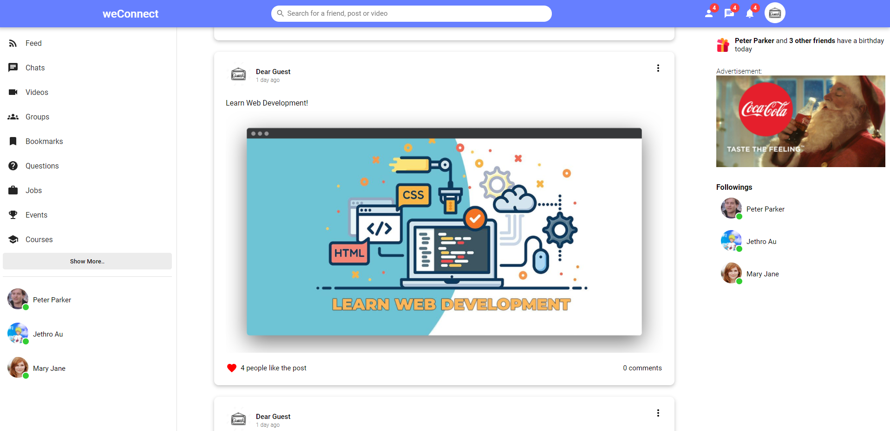

# social-media-client

## Welcome! 👋

weConnect is a fullstack social media web app built with the MERN stack (MongoDB, Express, ReactJS and NodeJS). This is the client side of the web app.

## Build with ⚙️

This is the client side of the social media web app. The client side is built with ReactJS. User password is encrypted with Bcrypt for security. All data are stored in MongoDB.

## Screenshots 📷

## Link 🔗

Link:
[Click Me!](https://weconnect-social-media.netlify.app/)

Server GitHub Link:
[Click Me!](https://github.com/obiito01/social-media-api)
